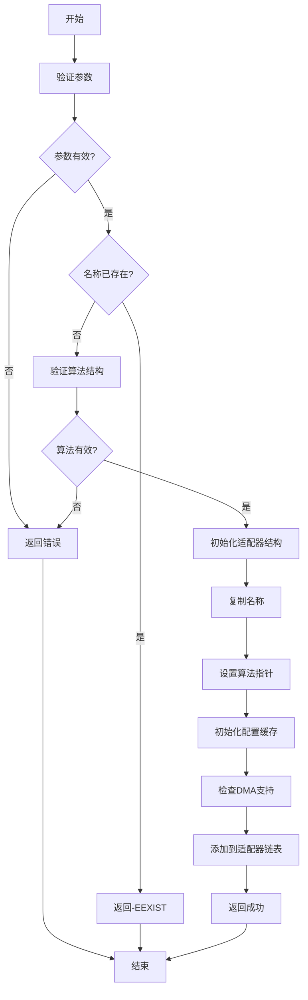
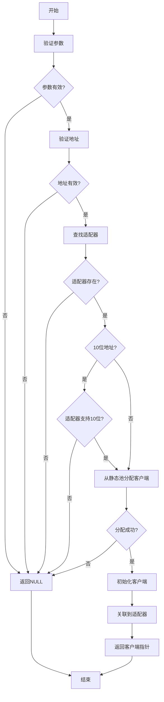
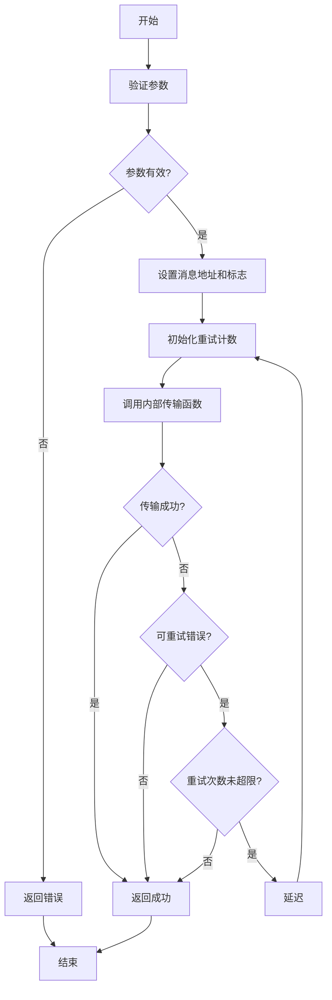
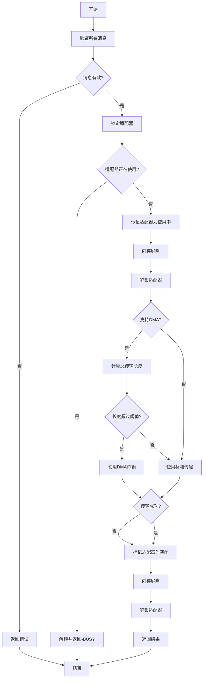
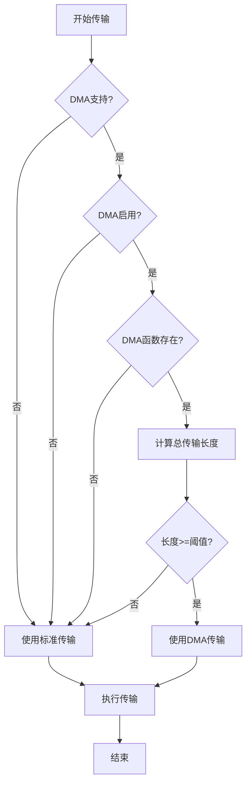

# I2C驱动框架设计文档

## 目录

1. [概述](#概述)
2. [设计目标](#设计目标)
3. [架构设计](#架构设计)
4. [核心数据结构](#核心数据结构)
5. [设计思路详解](#设计思路详解)
6. [使用指南](#使用指南)
7. [API参考](#api参考)
8. [流程图](#流程图)
9. [示例代码](#示例代码)
10. [地址模式详解](#地址模式详解)
11. [DMA传输机制](#dma传输机制)
12. [线程安全机制](#线程安全机制)
13. [错误处理和重试机制](#错误处理和重试机制)
14. [编译器优化兼容性](#编译器优化兼容性)
15. [常见问题](#常见问题)

---

## 概述

I2C驱动框架采用Linux内核风格的子系统设计，完全分离硬件抽象层和协议层，支持裸机和多种RTOS环境。框架设计遵循MISRA C:2012规范，无动态内存分配，最小化RAM和Flash占用。

### 主要特性

- **硬件抽象**：完全分离适配器驱动和协议层
- **资源优化**：静态分配，无动态内存
- **线程安全**：支持裸机、FreeRTOS、RT-Thread等环境
- **编译器优化兼容**：在不同优化级别下正常工作
- **Linux内核风格**：参考Linux内核I2C子系统设计
- **地址模式支持**：支持7位和10位地址模式
- **DMA支持**：自动选择DMA或中断/轮询传输
- **错误重试**：自动重试机制提高可靠性

---

## 设计目标

### 1. 清晰的硬件抽象

- **适配器抽象**：`i2c_adapter`结构体封装硬件适配器
- **算法抽象**：`i2c_algorithm`结构体定义硬件操作接口
- **客户端抽象**：`i2c_client`结构体表示I2C设备

### 2. 资源受限优化

- 所有资源静态分配（客户端使用静态池）
- 禁止使用`malloc`/`free`
- 最小化RAM和Flash占用
- 配置缓存避免重复配置

### 3. 高效安全

- 符合MISRA C:2012规范
- 线程安全设计
- 内存屏障确保状态一致性
- 可重入函数设计
- 自动错误重试机制

### 4. Linux内核风格

- 参考Linux内核I2C子系统
- 简化适配MCU环境
- 消息级抽象（支持多消息传输）

---

## 架构设计

### 整体架构

```
┌─────────────────────────────────────────────────────────┐
│              应用层 (Application Layer)                 │
│  - i2c_master_send() / i2c_master_recv()               │
│  - i2c_write_then_read()                               │
│  - i2c_w8r8() / i2c_w8r16()                            │
└─────────────────────────────────────────────────────────┘
                        ↓
┌─────────────────────────────────────────────────────────┐
│            I2C协议层 (I2C Protocol Layer)                │
│  - i2c_adapter (适配器抽象)                             │
│  - i2c_client (客户端抽象)                              │
│  - i2c_msg (消息传输)                                  │
│  - 线程安全机制 (kmutex/中断锁)                         │
│  - 地址验证和转换                                       │
│  - DMA传输路径选择                                      │
│  - 错误重试机制                                         │
└─────────────────────────────────────────────────────────┘
                        ↓
┌─────────────────────────────────────────────────────────┐
│          BSP硬件层 (BSP Hardware Layer)                 │
│  - i2c_algorithm (硬件算法函数)                          │
│    - master_xfer()     : 标准传输（中断/轮询）          │
│    - master_xfer_dma(): DMA传输（可选）                 │
│  - HAL/LL库封装                                         │
│  - GPIO/DMA配置                                         │
│  - 中断处理                                             │
└─────────────────────────────────────────────────────────┘
```

### 层次说明

1. **应用层**：提供简化的API接口，隐藏底层复杂性
2. **协议层**：实现I2C协议逻辑，管理适配器和客户端，处理地址验证、DMA选择、错误重试
3. **硬件层**：由BSP实现，封装具体硬件操作

### I2C与SPI的主要区别

| 特性 | SPI | I2C |
|------|-----|-----|
| 设备选择 | CS信号 | 地址 |
| 地址模式 | 无 | 7位/10位 |
| 总线共享 | 不支持 | 支持（多设备） |
| 传输模式 | 全双工 | 半双工 |
| 控制信号 | CS | START/STOP |
| DMA支持 | 可选 | 可选（自动选择） |

---

## 核心数据结构

### 1. i2c_msg (消息结构)

```c
struct i2c_msg {
    uint16_t addr;                      // 从机地址（7位或10位）
    uint16_t flags;                     // 消息标志（I2C_M_RD, I2C_M_TEN等）
    uint16_t len;                       // 消息长度（字节）
    uint8_t *buf;                       // 数据缓冲区指针
    struct list_node msg_list;          // 消息链表节点（多消息传输）
};
```

**说明**：
- 表示单次I2C传输操作
- 可以链接形成多消息传输序列
- `flags`控制传输方向、地址模式等

**标志位说明**：
- `I2C_M_RD`：读操作（从从机到主机）
- `I2C_M_TEN`：10位地址模式
- `I2C_M_STOP`：传输后发送STOP条件
- `I2C_M_NOSTART`：不发送START条件（连续传输）
- `I2C_M_IGNORE_NAK`：忽略NAK响应

### 2. i2c_client (客户端结构)

```c
struct i2c_client {
    const char *name;                   // 设备名称
    struct i2c_adapter *adapter;        // 父适配器
    uint16_t addr;                      // 设备地址
    uint16_t flags;                      // 设备标志
    uint32_t timeout_ms;                // 超时时间（毫秒）
    void *driver_data;                  // 驱动私有数据
};
```

**说明**：
- 表示一个I2C设备
- 包含设备配置参数
- 从静态池分配，无动态内存

### 3. i2c_algorithm (算法结构)

```c
struct i2c_algorithm {
    int (*master_xfer)(struct i2c_adapter *adap, 
                       struct i2c_msg *msgs, 
                       int num);
    int (*master_xfer_dma)(struct i2c_adapter *adap,
                          struct i2c_msg *msgs,
                          int num);
    uint32_t functionality;            // 功能标志
};
```

**说明**：
- 定义硬件操作接口
- 由BSP层实现
- `master_xfer`：标准传输（中断/轮询）
- `master_xfer_dma`：DMA传输（可选）
- `functionality`：功能标志（支持的特性）

### 4. i2c_adapter (适配器结构)

```c
struct i2c_adapter {
    struct list_node node;              // 链表节点
    char name[I2C_NAME_MAX];            // 适配器名称
    const struct i2c_algorithm *algo;   // 算法函数
    void *algo_data;                    // 算法私有数据
    
    // 配置缓存（volatile保护）
    volatile uint32_t speed_hz;         // 总线速度（Hz）
    volatile uint32_t timeout_ms;       // 超时时间（毫秒）
    volatile uint8_t addr_width;       // 地址宽度：7或10
    
    // 线程安全支持
    void (*lock)(void *lock_data);
    void (*unlock)(void *lock_data);
    void *lock_data;
    void (*irq_disable)(void);
    void (*irq_enable)(void);
    
    // DMA支持标志
    uint8_t dma_supported : 1;          // DMA是否支持
    uint8_t dma_enabled : 1;             // DMA是否启用
    
    // 状态标志
    volatile uint8_t in_use : 1;        // 适配器是否正在使用
};
```

**说明**：
- 适配器抽象
- 配置缓存避免重复配置
- 线程安全机制支持
- DMA支持标志

---

## 设计思路详解

### 1. 硬件抽象设计

#### 问题
不同MCU的I2C控制器实现差异很大，直接操作硬件会导致代码不可移植。

#### 解决方案
采用三层抽象：
- **适配器抽象**：`i2c_adapter`封装适配器状态和配置
- **算法抽象**：`i2c_algorithm`定义硬件操作接口
- **客户端抽象**：`i2c_client`表示连接的设备

#### 优势
- 协议层代码完全独立于硬件
- BSP层只需实现算法函数
- 易于移植到不同MCU

### 2. 消息级抽象

#### 设计理念
参考Linux内核，采用消息（Message）级抽象：

```
Transfer (传输)
  ├── Message 1 (消息1): 写命令
  └── Message 2 (消息2): 读数据
```

#### 优势
- **灵活性**：一个传输可以包含多个消息
- **原子性**：传输中的所有消息原子执行
- **写-读组合**：支持先写后读的常见模式

#### 示例场景
```c
// 场景：先写寄存器地址，再读数据
struct i2c_msg msgs[2];

// 消息1：写寄存器地址
msgs[0].addr = 0x50;
msgs[0].flags = 0;  // 写操作
msgs[0].len = 1;
msgs[0].buf = &reg_addr;

// 消息2：读数据
msgs[1].addr = 0x50;
msgs[1].flags = I2C_M_RD;  // 读操作
msgs[1].len = 10;
msgs[1].buf = data;

i2c_transfer(client, msgs, 2);
```

### 3. 地址模式支持

#### 7位地址模式
- 地址范围：0x08-0x77（排除保留地址）
- 地址格式：7位地址 + 1位R/W
- 传输格式：`[S][Addr7:1|W/R][A][Data...][A][P]`

#### 10位地址模式
- 地址范围：0x000-0x3FF
- 地址格式：10位地址
- 传输格式：`[S][11110|A9|A8|W/R][A][A7:A0][A][Data...][A][P]`

#### 地址验证
```c
static int i2c_validate_addr(uint16_t addr, uint16_t flags)
{
    if ((flags & I2C_M_TEN) != 0U) {
        // 10位地址：0x000-0x3FF
        if (addr > 0x3FFU) {
            return -EINVAL;
        }
    } else {
        // 7位地址：0x08-0x77
        if ((addr < 0x08U) || (addr > 0x77U)) {
            return -EINVAL;
        }
    }
    return 0;
}
```

### 4. DMA传输自动选择

#### 设计目标
根据传输长度自动选择最优传输方式。

#### 实现机制
```c
// 计算总传输长度
total_len = 0U;
for (i = 0; i < num; i++) {
    total_len += (uint32_t)msgs[i].len;
}

// 判断是否使用DMA
if ((adap->dma_supported != 0U) && 
    (adap->dma_enabled != 0U) &&
    (adap->algo->master_xfer_dma != NULL) &&
    (total_len >= I2C_DMA_THRESHOLD)) {
    use_dma = 1U;
}

// 选择传输路径
if (use_dma != 0U) {
    ret = adap->algo->master_xfer_dma(adap, msgs, num);
} else {
    ret = adap->algo->master_xfer(adap, msgs, num);
}
```

#### 阈值配置
- `I2C_DMA_THRESHOLD = 16`：长度超过16字节使用DMA
- 可配置，根据实际硬件性能调整

### 5. 错误重试机制

#### 设计目标
提高I2C通信的可靠性，自动处理临时错误。

#### 实现机制
```c
retry = 0;
do {
    ret = i2c_transfer_internal(adap, client, msgs, num);
    
    if (ret >= 0) {
        break;  // 成功，退出
    }
    
    // 检查是否应该重试
    if ((ret == -EIO) || (ret == -ETIMEOUT)) {
        retry++;
        if (retry < I2C_MAX_RETRIES) {
            // 延迟后重试
            continue;
        }
    }
    
    // 其他错误不重试
    break;
} while (retry < I2C_MAX_RETRIES);
```

#### 重试策略
- **可重试错误**：`EIO`（I/O错误）、`ETIMEOUT`（超时）
- **不重试错误**：`EINVAL`（参数错误）、`ENODEV`（设备不存在）
- **最大重试次数**：`I2C_MAX_RETRIES = 3`

### 6. 线程安全设计

#### 设计目标
- 支持裸机环境（中断锁）
- 支持RTOS环境（互斥锁）
- 统一接口，自动适配

#### 实现方式
使用函数指针抽象锁机制：
```c
struct i2c_adapter {
    void (*lock)(void *lock_data);      // RTOS: mutex_lock
    void (*unlock)(void *lock_data);    // RTOS: mutex_unlock
    void *lock_data;                    // RTOS: mutex handle
    
    void (*irq_disable)(void);         // 裸机: __disable_irq
    void (*irq_enable)(void);           // 裸机: __enable_irq
};
```

#### 锁机制选择
```c
static inline void i2c_adapter_lock(struct i2c_adapter *adap)
{
    if (adap->lock != NULL) {
        // RTOS环境：使用互斥锁
        adap->lock(adap->lock_data);
    } else if (adap->irq_disable != NULL) {
        // 裸机环境：禁用中断
        adap->irq_disable();
    }
}
```

### 7. 静态客户端池

#### 问题
避免动态内存分配，提高实时性。

#### 解决方案
使用静态客户端池：
```c
#define I2C_MAX_CLIENTS 16U

static struct i2c_client i2c_client_pool[I2C_MAX_CLIENTS];
static uint8_t i2c_client_used[I2C_MAX_CLIENTS];
```

#### 分配机制
```c
static struct i2c_client *i2c_alloc_client(void)
{
    uint8_t i = 0U;
    
    for (i = 0U; i < I2C_MAX_CLIENTS; i++) {
        if (i2c_client_used[i] == 0U) {
            i2c_client_used[i] = 1U;
            memset(&i2c_client_pool[i], 0, sizeof(struct i2c_client));
            return &i2c_client_pool[i];
        }
    }
    
    return NULL;  // 池已满
}
```

---

## 使用指南

### 快速开始

#### 步骤1：实现BSP层硬件算法

```c
// 1. 定义硬件私有数据结构
struct stm32_i2c_priv {
    I2C_HandleTypeDef *hi2c;
    // 其他硬件相关数据
};

// 2. 实现master_xfer函数（标准传输）
static int stm32_i2c_master_xfer(struct i2c_adapter *adap, 
                                  struct i2c_msg *msgs, 
                                  int num)
{
    struct stm32_i2c_priv *priv = adap->algo_data;
    I2C_HandleTypeDef *hi2c = priv->hi2c;
    HAL_StatusTypeDef status;
    int i = 0;
    int ret = 0;
    
    for (i = 0; i < num; i++) {
        if ((msgs[i].flags & I2C_M_RD) != 0U) {
            // 读操作
            status = HAL_I2C_Master_Receive(hi2c, 
                                            msgs[i].addr << 1,
                                            msgs[i].buf,
                                            msgs[i].len,
                                            adap->timeout_ms);
        } else {
            // 写操作
            status = HAL_I2C_Master_Transmit(hi2c,
                                             msgs[i].addr << 1,
                                             (uint8_t *)msgs[i].buf,
                                             msgs[i].len,
                                             adap->timeout_ms);
        }
        
        if (status != HAL_OK) {
            ret = -EIO;
            break;
        }
    }
    
    if (ret == 0) {
        return num;  // 返回成功传输的消息数
    }
    
    return ret;
}

// 3. 实现master_xfer_dma函数（DMA传输，可选）
static int stm32_i2c_master_xfer_dma(struct i2c_adapter *adap,
                                     struct i2c_msg *msgs,
                                     int num)
{
    struct stm32_i2c_priv *priv = adap->algo_data;
    I2C_HandleTypeDef *hi2c = priv->hi2c;
    HAL_StatusTypeDef status;
    int i = 0;
    int ret = 0;
    
    for (i = 0; i < num; i++) {
        if ((msgs[i].flags & I2C_M_RD) != 0U) {
            // DMA读操作
            status = HAL_I2C_Master_Receive_DMA(hi2c,
                                                msgs[i].addr << 1,
                                                msgs[i].buf,
                                                msgs[i].len);
        } else {
            // DMA写操作
            status = HAL_I2C_Master_Transmit_DMA(hi2c,
                                                 msgs[i].addr << 1,
                                                 (uint8_t *)msgs[i].buf,
                                                 msgs[i].len);
        }
        
        if (status != HAL_OK) {
            ret = -EIO;
            break;
        }
        
        // 等待DMA完成
        while (HAL_I2C_GetState(hi2c) != HAL_I2C_STATE_READY);
    }
    
    if (ret == 0) {
        return num;
    }
    
    return ret;
}

// 4. 定义算法结构
static const struct i2c_algorithm stm32_i2c_algorithm = {
    .master_xfer = stm32_i2c_master_xfer,
    .master_xfer_dma = stm32_i2c_master_xfer_dma,  // 可选
    .functionality = I2C_FUNC_I2C | 
                     I2C_FUNC_10BIT_ADDR | 
                     I2C_FUNC_DMA_SUPPORT,
};
```

#### 步骤2：注册适配器

```c
void bsp_i2c_init(void)
{
    struct i2c_adapter adap;
    struct stm32_i2c_priv priv;
    
    // 初始化硬件
    priv.hi2c = &hi2c1;
    hi2c1.Instance = I2C1;
    hi2c1.Init.ClockSpeed = 100000;  // 100kHz
    hi2c1.Init.DutyCycle = I2C_DUTYCYCLE_2;
    hi2c1.Init.OwnAddress1 = 0;
    hi2c1.Init.AddressingMode = I2C_ADDRESSINGMODE_7BIT;
    hi2c1.Init.DualAddressMode = I2C_DUALADDRESS_DISABLE;
    hi2c1.Init.GeneralCallMode = I2C_GENERALCALL_DISABLE;
    hi2c1.Init.NoStretchMode = I2C_NOSTRETCH_DISABLE;
    HAL_I2C_Init(&hi2c1);
    
    // 配置线程安全（RTOS环境）
    #ifdef USING_FREERTOS
    static SemaphoreHandle_t i2c_mutex = NULL;
    i2c_mutex = xSemaphoreCreateMutex();
    adap.lock = (void (*)(void *))xSemaphoreTake;
    adap.unlock = (void (*)(void *))xSemaphoreGive;
    adap.lock_data = i2c_mutex;
    #else
    // 裸机环境：使用中断锁
    adap.irq_disable = __disable_irq;
    adap.irq_enable = __enable_irq;
    #endif
    
    // 注册适配器
    adap.algo_data = &priv;
    i2c_add_adapter(&adap, "i2c1", &stm32_i2c_algorithm);
}
```

#### 步骤3：创建客户端设备

```c
void my_device_init(void)
{
    struct i2c_client *client;
    
    // 创建7位地址设备
    client = i2c_new_client("eeprom", "i2c1", 0x50, 0);
    if (client == NULL) {
        // 处理错误
        return;
    }
    
    // 创建10位地址设备
    client = i2c_new_client("sensor", "i2c1", 0x123, I2C_M_TEN);
    if (client == NULL) {
        // 处理错误
        return;
    }
}
```

#### 步骤4：使用设备进行传输

```c
void my_device_transfer(void)
{
    struct i2c_client *client;
    uint8_t tx_data[10] = {0x01, 0x02, 0x03, ...};
    uint8_t rx_data[10];
    int ret;
    
    // 获取客户端（假设已创建）
    client = /* ... */;
    
    // 方法1：使用简化接口
    ret = i2c_master_send(client, tx_data, 10);
    if (ret < 0) {
        // 处理错误
        return;
    }
    
    ret = i2c_master_recv(client, rx_data, 10);
    if (ret < 0) {
        // 处理错误
        return;
    }
    
    // 方法2：使用写-读组合
    uint8_t reg_addr = 0x00;
    ret = i2c_write_then_read(client, &reg_addr, 1, rx_data, 10);
    if (ret < 0) {
        // 处理错误
        return;
    }
    
    // 方法3：使用消息接口（更灵活）
    struct i2c_msg msgs[2];
    
    msgs[0].addr = client->addr;
    msgs[0].flags = client->flags;
    msgs[0].len = 1;
    msgs[0].buf = &reg_addr;
    list_node_init(&msgs[0].msg_list);
    
    msgs[1].addr = client->addr;
    msgs[1].flags = client->flags | I2C_M_RD;
    msgs[1].len = 10;
    msgs[1].buf = rx_data;
    list_node_init(&msgs[1].msg_list);
    
    ret = i2c_transfer(client, msgs, 2);
    if (ret < 0) {
        // 处理错误
        return;
    }
}
```

---

## API参考

### 适配器管理API

#### i2c_add_adapter()

注册I2C适配器。

```c
int i2c_add_adapter(struct i2c_adapter *adap, 
                    const char *name, 
                    const struct i2c_algorithm *algo);
```

**参数**：
- `adap`：适配器结构体指针
- `name`：适配器名称（唯一标识）
- `algo`：算法函数指针

**返回值**：
- `0`：成功
- `-EINVAL`：参数错误
- `-EEXIST`：名称已存在

**示例**：
```c
struct i2c_adapter adap;
i2c_add_adapter(&adap, "i2c1", &stm32_i2c_algorithm);
```

#### i2c_find_adapter()

查找适配器。

```c
struct i2c_adapter *i2c_find_adapter(const char *name);
```

**参数**：
- `name`：适配器名称

**返回值**：
- 适配器指针：成功
- `NULL`：未找到

### 客户端管理API

#### i2c_new_client()

创建新的I2C客户端设备。

```c
struct i2c_client *i2c_new_client(const char *name,
                                  const char *adapter_name,
                                  uint16_t addr,
                                  uint16_t flags);
```

**参数**：
- `name`：设备名称
- `adapter_name`：适配器名称
- `addr`：设备地址（7位或10位）
- `flags`：设备标志（I2C_M_TEN等）

**返回值**：
- 客户端指针：成功
- `NULL`：失败

**示例**：
```c
// 7位地址设备
struct i2c_client *client = i2c_new_client("eeprom", "i2c1", 0x50, 0);

// 10位地址设备
struct i2c_client *client = i2c_new_client("sensor", "i2c1", 0x123, I2C_M_TEN);
```

#### i2c_del_client()

删除I2C客户端设备。

```c
int i2c_del_client(struct i2c_client *client);
```

### 传输API

#### i2c_master_send()

发送数据（简化接口）。

```c
int i2c_master_send(struct i2c_client *client, const void *buf, size_t count);
```

**参数**：
- `client`：客户端指针
- `buf`：数据缓冲区
- `count`：数据长度

**返回值**：
- 发送的字节数：成功
- 负数：错误码

#### i2c_master_recv()

接收数据（简化接口）。

```c
int i2c_master_recv(struct i2c_client *client, void *buf, size_t count);
```

#### i2c_write_then_read()

先写后读。

```c
int i2c_write_then_read(struct i2c_client *client,
                       const void *write_buf, size_t write_len,
                       void *read_buf, size_t read_len);
```

**说明**：
- 常用于寄存器读取：先写寄存器地址，再读数据
- 原子操作，中间不发送STOP条件

#### i2c_w8r8()

写一个字节，读一个字节。

```c
int i2c_w8r8(struct i2c_client *client, uint8_t cmd, uint8_t *result);
```

#### i2c_w8r16()

写一个字节，读两个字节。

```c
int i2c_w8r16(struct i2c_client *client, uint8_t cmd, uint16_t *result);
```

#### i2c_transfer()

同步传输消息（底层接口）。

```c
int i2c_transfer(struct i2c_client *client, 
                 struct i2c_msg *msgs, 
                 int num);
```

**说明**：
- 这是底层接口，提供最大灵活性
- 可以包含多个消息
- 支持复杂的传输序列

---

## 流程图

### 适配器注册流程



### 客户端创建流程



### 消息传输流程



### 内部传输流程



### DMA选择流程



---

## 示例代码

### 示例1：基本读写操作

```c
#include "i2c.h"

void example_basic_rw(void)
{
    struct i2c_client *eeprom_client;
    uint8_t tx_data[256];
    uint8_t rx_data[256];
    int ret;
    
    // 创建客户端
    eeprom_client = i2c_new_client("eeprom", "i2c1", 0x50, 0);
    if (eeprom_client == NULL) {
        // 处理错误
        return;
    }
    
    // 写入数据
    (void)memset(tx_data, 0xAA, sizeof(tx_data));
    ret = i2c_master_send(eeprom_client, tx_data, sizeof(tx_data));
    if (ret < 0) {
        // 处理错误
        return;
    }
    
    // 读取数据
    ret = i2c_master_recv(eeprom_client, rx_data, sizeof(rx_data));
    if (ret < 0) {
        // 处理错误
        return;
    }
}
```

### 示例2：寄存器读写（写-读组合）

```c
void example_register_rw(void)
{
    struct i2c_client *sensor_client;
    uint8_t reg_addr = 0x03;  // 温度寄存器
    uint8_t temp_data[2];
    int ret;
    
    // 创建客户端
    sensor_client = i2c_new_client("sensor", "i2c1", 0x48, 0);
    if (sensor_client == NULL) {
        return;
    }
    
    // 写寄存器地址，读数据
    ret = i2c_write_then_read(sensor_client, &reg_addr, 1, temp_data, 2);
    if (ret < 0) {
        // 处理错误
        return;
    }
    
    // 解析温度数据
    int16_t temperature = (int16_t)((temp_data[0] << 8) | temp_data[1]);
}
```

### 示例3：使用消息接口（复杂场景）

```c
void example_complex_transfer(void)
{
    struct i2c_client *client;
    struct i2c_msg msgs[3];
    uint8_t cmd1 = 0x01;
    uint8_t cmd2 = 0x02;
    uint8_t data[10];
    int ret;
    
    // 创建客户端
    client = i2c_new_client("device", "i2c1", 0x50, 0);
    if (client == NULL) {
        return;
    }
    
    // 消息1：写命令1
    msgs[0].addr = client->addr;
    msgs[0].flags = client->flags;
    msgs[0].len = 1;
    msgs[0].buf = &cmd1;
    list_node_init(&msgs[0].msg_list);
    
    // 消息2：写命令2（不发送STOP）
    msgs[1].addr = client->addr;
    msgs[1].flags = client->flags | I2C_M_NOSTART;
    msgs[1].len = 1;
    msgs[1].buf = &cmd2;
    list_node_init(&msgs[1].msg_list);
    
    // 消息3：读数据
    msgs[2].addr = client->addr;
    msgs[2].flags = client->flags | I2C_M_RD;
    msgs[2].len = 10;
    msgs[2].buf = data;
    list_node_init(&msgs[2].msg_list);
    
    // 执行传输
    ret = i2c_transfer(client, msgs, 3);
    if (ret < 0) {
        // 处理错误
        return;
    }
}
```

### 示例4：10位地址设备

```c
void example_10bit_addr(void)
{
    struct i2c_client *client;
    uint8_t data[10];
    int ret;
    
    // 创建10位地址客户端
    client = i2c_new_client("sensor_10bit", "i2c1", 0x123, I2C_M_TEN);
    if (client == NULL) {
        // 适配器可能不支持10位地址
        return;
    }
    
    // 使用方式与7位地址相同
    ret = i2c_master_recv(client, data, sizeof(data));
    if (ret < 0) {
        // 处理错误
        return;
    }
}
```

### 示例5：多设备切换

```c
void example_multi_device(void)
{
    struct i2c_client *dev1, *dev2;
    uint8_t data1[10], data2[10];
    
    // 设备1：EEPROM (0x50)
    dev1 = i2c_new_client("eeprom", "i2c1", 0x50, 0);
    
    // 设备2：传感器 (0x48)
    dev2 = i2c_new_client("sensor", "i2c1", 0x48, 0);
    
    // 使用设备1
    i2c_master_send(dev1, data1, 10);
    
    // 切换到设备2（自动处理）
    i2c_master_send(dev2, data2, 10);
    
    // 再次使用设备1
    i2c_master_recv(dev1, data1, 10);
}
```

---

## 地址模式详解

### 7位地址模式

#### 地址范围
- 有效地址：0x08 - 0x77
- 排除保留地址：0x00-0x07, 0x78-0x7F

#### 传输格式
```
[S][Addr7:1|W/R][A][Data...][A][P]
```
- `S`：START条件
- `Addr7:1|W/R`：7位地址 + 1位读写标志
- `A`：ACK
- `Data`：数据字节
- `P`：STOP条件

#### 使用示例
```c
// 创建7位地址设备
struct i2c_client *client = i2c_new_client("device", "i2c1", 0x50, 0);
```

### 10位地址模式

#### 地址范围
- 有效地址：0x000 - 0x3FF

#### 传输格式
```
写操作：
[S][11110|A9|A8|W][A][A7:A0][A][Data...][A][P]

读操作：
[S][11110|A9|A8|W][A][A7:A0][A][Sr][11110|A9|A8|R][A][Data...][A][P]
```
- `11110`：10位地址标识
- `A9|A8`：地址高2位
- `A7:A0`：地址低8位
- `Sr`：重复START条件

#### 使用示例
```c
// 创建10位地址设备
struct i2c_client *client = i2c_new_client("device", "i2c1", 0x123, I2C_M_TEN);
```

### 地址验证

框架自动验证地址有效性：

```c
static int i2c_validate_addr(uint16_t addr, uint16_t flags)
{
    if ((flags & I2C_M_TEN) != 0U) {
        // 10位地址验证
        if (addr > 0x3FFU) {
            return -EINVAL;
        }
    } else {
        // 7位地址验证
        if ((addr < 0x08U) || (addr > 0x77U)) {
            return -EINVAL;
        }
    }
    return 0;
}
```

---

## DMA传输机制

### DMA支持检测

适配器注册时自动检测DMA支持：

```c
// 检查算法是否支持DMA
if ((algo->functionality & I2C_FUNC_DMA_SUPPORT) != 0U) {
    adap->dma_supported = 1U;
} else {
    adap->dma_supported = 0U;
}
adap->dma_enabled = adap->dma_supported;
```

### DMA自动选择

传输时自动选择最优方式：

```c
// 计算总传输长度
total_len = 0U;
for (i = 0; i < num; i++) {
    total_len += (uint32_t)msgs[i].len;
}

// 判断是否使用DMA
if ((adap->dma_supported != 0U) && 
    (adap->dma_enabled != 0U) &&
    (adap->algo->master_xfer_dma != NULL) &&
    (total_len >= I2C_DMA_THRESHOLD)) {
    use_dma = 1U;
}
```

### DMA阈值配置

- **默认阈值**：`I2C_DMA_THRESHOLD = 16`字节
- **选择原则**：
  - 小数据量：使用中断/轮询（开销小）
  - 大数据量：使用DMA（效率高）
- **可调整**：根据实际硬件性能调整阈值

### BSP层DMA实现

```c
static int stm32_i2c_master_xfer_dma(struct i2c_adapter *adap,
                                     struct i2c_msg *msgs,
                                     int num)
{
    I2C_HandleTypeDef *hi2c = adap->algo_data;
    HAL_StatusTypeDef status;
    int i = 0;
    
    for (i = 0; i < num; i++) {
        if ((msgs[i].flags & I2C_M_RD) != 0U) {
            // DMA读
            status = HAL_I2C_Master_Receive_DMA(hi2c,
                                                msgs[i].addr << 1,
                                                msgs[i].buf,
                                                msgs[i].len);
        } else {
            // DMA写
            status = HAL_I2C_Master_Transmit_DMA(hi2c,
                                                 msgs[i].addr << 1,
                                                 (uint8_t *)msgs[i].buf,
                                                 msgs[i].len);
        }
        
        if (status != HAL_OK) {
            return -EIO;
        }
        
        // 等待DMA完成
        while (HAL_I2C_GetState(hi2c) != HAL_I2C_STATE_READY);
    }
    
    return num;
}
```

---

## 线程安全机制

### 设计原理

框架通过函数指针抽象锁机制，自动适配不同环境：

```c
// RTOS环境
adap->lock = (void (*)(void *))xSemaphoreTake;
adap->unlock = (void (*)(void *))xSemaphoreGive;
adap->lock_data = mutex_handle;

// 裸机环境
adap->irq_disable = __disable_irq;
adap->irq_enable = __enable_irq;
```

### 使用场景

1. **适配器状态检查**：防止状态被其他线程修改
2. **适配器使用标记**：原子标记适配器为使用中
3. **配置更新**：安全更新适配器配置

### 注意事项

- 锁的粒度要小，避免长时间持有
- 不要在锁内调用可能阻塞的函数
- 中断上下文必须使用中断锁

---

## 错误处理和重试机制

### 错误类型

#### 可重试错误
- `EIO`：I/O错误（总线错误、NACK等）
- `ETIMEOUT`：超时错误

#### 不可重试错误
- `EINVAL`：参数错误
- `ENODEV`：设备不存在
- `EBUSY`：适配器忙
- `ENOSYS`：功能不支持

### 重试机制

```c
retry = 0;
do {
    ret = i2c_transfer_internal(adap, client, msgs, num);
    
    if (ret >= 0) {
        break;  // 成功，退出
    }
    
    // 检查是否应该重试
    if ((ret == -EIO) || (ret == -ETIMEOUT)) {
        retry++;
        if (retry < I2C_MAX_RETRIES) {
            // 延迟后重试（实际实现应使用延时函数）
            continue;
        }
    }
    
    // 其他错误不重试
    break;
} while (retry < I2C_MAX_RETRIES);
```

### 重试策略

- **最大重试次数**：`I2C_MAX_RETRIES = 3`
- **重试延迟**：建议10-50ms（根据总线速度调整）
- **适用场景**：临时总线错误、设备响应延迟

---

## 编译器优化兼容性

### 问题场景

编译器优化可能导致：
1. 指令重排
2. 状态读取不一致
3. 内存操作顺序错误

### 解决方案

#### 1. volatile关键字

```c
volatile uint32_t speed_hz;         // 防止优化
volatile uint8_t in_use;            // 强制每次读取
```

#### 2. 内存屏障

```c
adap->in_use = 1U;
__DSB();  // 确保写入完成
```

#### 3. 编译器屏障

```c
asm volatile("" ::: "memory");  // 防止指令重排
```

#### 4. noinline属性

```c
static int __attribute__((noinline))
i2c_transfer_internal(...) {
    // 防止被内联优化
}
```

### 测试验证

在不同优化级别（-O0, -O1, -O2, -O3, -Os）下测试，确保行为一致。

---

## 常见问题

### Q1: 如何选择7位还是10位地址？

**A**: 
- **7位地址**：大多数设备使用，地址范围0x08-0x77
- **10位地址**：特殊设备使用，地址范围0x000-0x3FF

**选择建议**：
- 查看设备数据手册确定地址模式
- 10位地址需要适配器支持（检查`I2C_FUNC_10BIT_ADDR`标志）

### Q2: 如何实现DMA传输？

**A**: 
1. 在算法结构中实现`master_xfer_dma`函数
2. 设置`functionality`标志包含`I2C_FUNC_DMA_SUPPORT`
3. 框架会自动选择DMA传输（当长度超过阈值时）

### Q3: 多设备共享总线时如何避免冲突？

**A**: 
- 框架自动管理适配器锁定
- 每个设备使用不同的地址
- I2C协议本身支持多设备共享总线

### Q4: 如何调试I2C通信问题？

**A**: 
1. 检查设备是否正确创建并附加到适配器
2. 验证地址是否正确（7位/10位）
3. 使用示波器检查SDA、SCL信号
4. 检查总线速度配置
5. 查看错误码确定问题类型

### Q5: 重试机制何时触发？

**A**: 
- **触发条件**：`EIO`或`ETIMEOUT`错误
- **重试次数**：最多3次
- **适用场景**：临时总线错误、设备响应延迟

### Q6: 如何提高I2C传输速度？

**A**: 
1. 使用更高的总线速度（根据设备支持）
2. 使用DMA传输（大数据量）
3. 减少不必要的重试
4. 优化消息序列（减少START/STOP条件）

### Q7: 静态客户端池满了怎么办？

**A**: 
- 默认支持16个客户端
- 如果不够，可以修改`I2C_MAX_CLIENTS`宏定义
- 或者删除不使用的客户端释放资源

---

## 总结

I2C驱动框架采用Linux内核风格设计，提供了清晰的硬件抽象和灵活的接口。通过适配器-客户端抽象、地址模式支持、DMA自动选择、错误重试等机制，实现了高效、安全、易用的I2C驱动框架。

### 核心优势

1. **硬件抽象**：完全分离协议层和硬件层
2. **资源优化**：静态分配，无动态内存
3. **线程安全**：支持多种环境
4. **编译器兼容**：在不同优化级别下正常工作
5. **易于使用**：提供简化接口和底层接口
6. **地址支持**：支持7位和10位地址模式
7. **DMA支持**：自动选择最优传输方式
8. **错误重试**：提高通信可靠性

### 适用场景

- 嵌入式MCU应用
- 资源受限环境
- 多设备I2C通信
- 需要高可靠性的应用
- 需要支持7位和10位地址的应用

---

**文档版本**: V1.0  
**最后更新**: 2025-01-XX  
**作者**: ZJY

