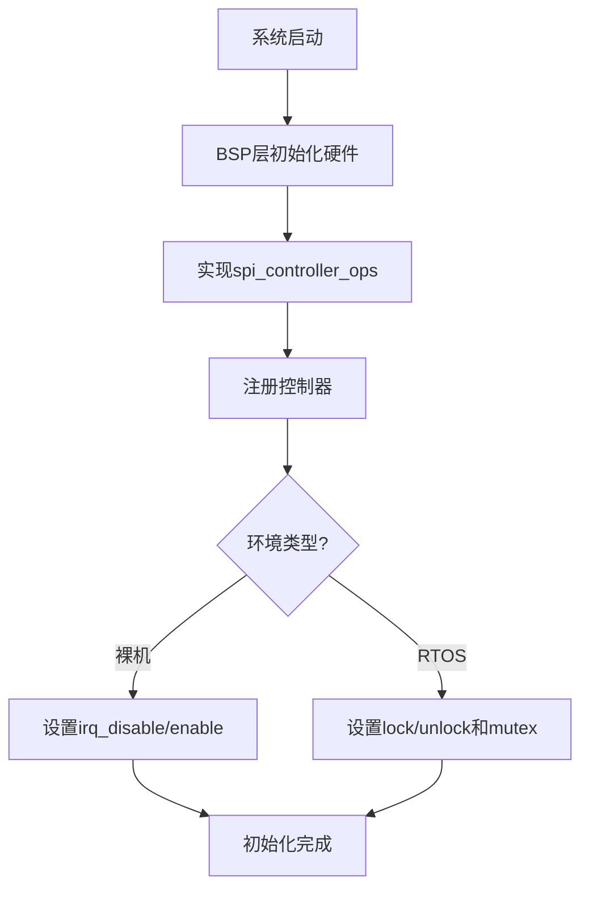
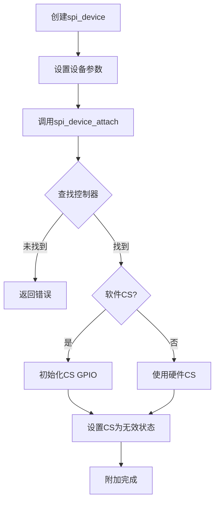
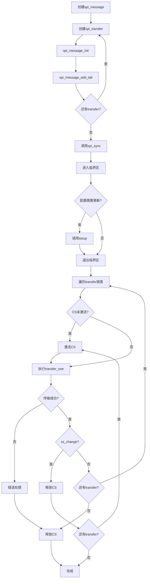
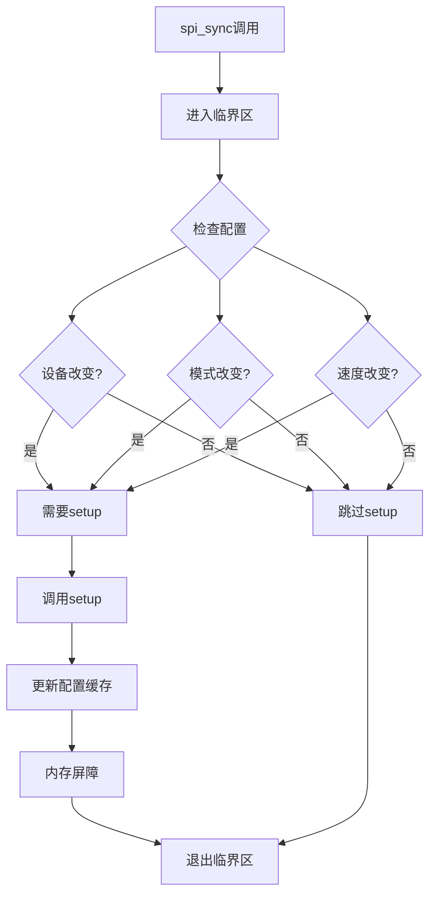
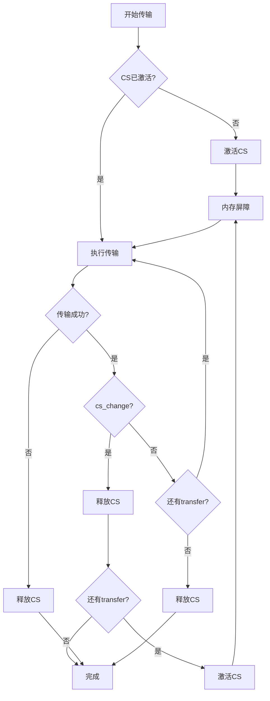

# SPI驱动框架设计文档

## 目录

1. [概述](#概述)
2. [设计目标](#设计目标)
3. [架构设计](#架构设计)
4. [核心概念](#核心概念)
5. [数据结构](#数据结构)
6. [API接口](#api接口)
7. [使用指南](#使用指南)
8. [线程安全](#线程安全)
9. [编译器优化兼容性](#编译器优化兼容性)
10. [流程图](#流程图)
11. [示例代码](#示例代码)
12. [BSP层实现](#bsp层实现)

---

## 概述

本SPI驱动框架参考Linux内核SPI子系统设计，但针对资源受限的MCU环境进行了简化和优化。框架提供了清晰的硬件抽象层，支持裸机环境和RTOS环境，确保在高优化级别下也能正常工作。

### 主要特性

- **硬件抽象**：清晰的控制器/设备分离，摆脱硬件实现差异
- **线程安全**：支持裸机（中断控制）和RTOS（互斥锁）两种模式
- **编译器优化兼容**：使用volatile和内存屏障，确保高优化级别下正确性
- **资源受限优化**：最小化RAM和Flash占用，静态分配，无动态内存
- **MISRA C合规**：符合MISRA C:2012规范

---

## 设计目标

### 1. 清晰的硬件抽象

分离SPI控制器驱动和协议层，使上层应用代码不依赖具体硬件实现。

### 2. 资源受限优化

- 最小化RAM和Flash占用
- 静态分配，无动态内存
- 适合STM32F1等资源受限的MCU

### 3. 高效安全

- 符合MISRA C:2012规范
- 优化性能
- 确保线程安全

### 4. 多环境兼容

- 支持裸机环境（无RTOS）
- 支持RTOS环境（FreeRTOS、RT-Thread等）
- 高优化级别下正常工作

---

## 架构设计

### 三层架构

```
┌─────────────────────────────────────┐
│  协议层 (Protocol Layer)            │
│  - spi_device                       │
│  - spi_message                      │
│  - spi_transfer                     │
│  - spi_sync()                       │
│  - spi_write/read()                 │
└─────────────────────────────────────┘
              ↓
┌─────────────────────────────────────┐
│  控制器抽象层 (Controller Layer)    │
│  - spi_controller                   │
│  - spi_controller_ops               │
│  - 配置管理、CS控制                 │
│  - 线程安全保护                     │
└─────────────────────────────────────┘
              ↓
┌─────────────────────────────────────┐
│  硬件驱动层 (BSP Layer)             │
│  - bsp_spi_ops实现                  │
│  - 具体硬件初始化                   │
│  - HAL/LL驱动调用                   │
└─────────────────────────────────────┘
```

### 设计理念

1. **分离关注点**：控制器驱动 vs 协议驱动
2. **消息队列机制**：支持多传输合并，提高效率
3. **灵活的CS控制**：支持硬件和软件CS
4. **配置缓存**：避免重复配置，提高性能

---

## 核心概念

### 1. SPI Controller (控制器)

SPI控制器代表一个物理SPI外设（如STM32的SPI1、SPI2等）。一个控制器可以连接多个SPI设备。

### 2. SPI Device (设备)

SPI设备代表一个连接到SPI总线的从设备（如SPI NOR Flash、传感器等）。每个设备有自己的配置参数（速度、模式等）。

### 3. SPI Transfer (传输)

单次数据传输的描述符，包含发送缓冲区、接收缓冲区、长度等信息。

### 4. SPI Message (消息)

消息是一个或多个transfer的集合，可以作为一个原子操作执行。

---

## 数据结构

### spi_transfer

```c
struct spi_transfer {
    const void *tx_buf;                // 发送缓冲区
    void *rx_buf;                      // 接收缓冲区
    size_t len;                        // 传输长度（字节）
    unsigned cs_change : 1;            // 传输后改变CS状态
    struct list_node transfer_list;    // 消息链表节点
};
```

### spi_message

```c
struct spi_message {
    struct list_node transfers;        // transfer链表头
    struct spi_device *spi;           // 关联的SPI设备
    int status;                        // 传输状态：0成功，<0错误
    void *context;                     // 上下文指针（可选）
};
```

### spi_device

```c
struct spi_device {
    const char *name;                  // 设备名称
    struct spi_controller *controller; // 父控制器
    uint32_t max_speed_hz;             // 最大时钟频率(Hz)
    uint8_t chip_select;               // CS编号（硬件CS，0-15）
    uint8_t mode;                      // SPI模式 (SPI_MODE_0-3)
    uint8_t bits_per_word;             // 每字位数（通常8）
    size_t cs_pin;                     // CS引脚（软件CS，0表示使用硬件CS）
    void *controller_data;             // 控制器私有数据
};
```

### spi_controller

```c
struct spi_controller {
    struct list_node node;                      // 链表节点
    char name[SPI_NAME_MAX];                    // 控制器名称
    const struct spi_controller_ops *ops;      // 操作函数表
    void *priv;                                 // 私有数据（指向BSP实现）
    
    /* 配置缓存（避免重复配置）- 使用volatile保护 */
    volatile uint8_t mode;                      // 当前模式
    volatile uint8_t bits_per_word;             // 当前每字位数
    volatile uint32_t max_speed_hz;             // 最大速度
    volatile uint32_t actual_speed_hz;          // 实际配置速度
    struct spi_device *current_device;         // 当前配置的设备
    
    /* 线程安全支持（可选） */
    void (*lock)(void *lock_data);              // 加锁函数（RTOS环境）
    void (*unlock)(void *lock_data);            // 解锁函数（RTOS环境）
    void *lock_data;                            // 锁数据（如mutex句柄）
    
    /* 中断控制支持（可选） */
    void (*irq_disable)(void);                  // 禁用中断（裸机环境）
    void (*irq_enable)(void);                   // 使能中断（裸机环境）
};
```

### spi_controller_ops

```c
struct spi_controller_ops {
    int (*setup)(struct spi_controller *ctrl, struct spi_device *dev);
    void (*set_cs)(struct spi_controller *ctrl, struct spi_device *dev, uint8_t enable);
    ssize_t (*transfer_one)(struct spi_controller *ctrl, 
                           struct spi_device *dev,
                           struct spi_transfer *transfer);
};
```

---

## API接口

### 控制器管理

#### spi_controller_register

注册SPI控制器。

```c
int spi_controller_register(struct spi_controller *ctrl, 
                            const char *name, 
                            const struct spi_controller_ops *ops);
```

**参数：**
- `ctrl`: 控制器结构体指针
- `name`: 控制器名称（如"spi1"）
- `ops`: 操作函数表指针

**返回值：**
- `0`: 成功
- `<0`: 错误码

#### spi_controller_find

查找SPI控制器。

```c
struct spi_controller *spi_controller_find(const char *name);
```

**参数：**
- `name`: 控制器名称

**返回值：**
- 控制器指针：成功
- `NULL`: 未找到

### 设备管理

#### spi_device_attach

将SPI设备附加到控制器。

```c
int spi_device_attach(struct spi_device *dev, const char *controller_name);
```

**参数：**
- `dev`: 设备结构体指针
- `controller_name`: 控制器名称

**返回值：**
- `0`: 成功
- `<0`: 错误码

### 消息传输

#### spi_message_init

初始化SPI消息。

```c
void spi_message_init(struct spi_message *m);
```

#### spi_message_add_tail

添加transfer到消息尾部。

```c
void spi_message_add_tail(struct spi_transfer *t, struct spi_message *m);
```

#### spi_sync

同步执行SPI消息传输。

```c
int spi_sync(struct spi_device *dev, struct spi_message *message);
```

**返回值：**
- `0`: 成功
- `<0`: 错误码

### 便捷函数

#### spi_write

写入数据到SPI设备。

```c
int spi_write(struct spi_device *spi, const void *buf, size_t len);
```

#### spi_read

从SPI设备读取数据。

```c
int spi_read(struct spi_device *spi, void *buf, size_t len);
```

#### spi_write_then_read

先写后读操作。

```c
int spi_write_then_read(struct spi_device *spi, 
                        const void *txbuf, size_t txlen, 
                        void *rxbuf, size_t rxlen);
```

#### spi_w8r8

写一个字节，读一个字节。

```c
int spi_w8r8(struct spi_device *spi, uint8_t cmd);
```

**返回值：**
- `>=0`: 读取的字节值
- `<0`: 错误码

#### spi_w8r16

写一个字节，读两个字节。

```c
int spi_w8r16(struct spi_device *spi, uint8_t cmd, uint16_t *result);
```

---

## 使用指南

### 1. BSP层实现

首先需要在BSP层实现`spi_controller_ops`：

```c
/* 硬件setup函数 */
static int stm32_spi_setup(struct spi_controller *ctrl, 
                           struct spi_device *dev)
{
    /* 配置SPI硬件参数 */
    /* 设置时钟、模式、数据位宽等 */
    /* 将实际配置的速度保存到 ctrl->actual_speed_hz */
    return 0;
}

/* CS控制函数 */
static void stm32_spi_set_cs(struct spi_controller *ctrl, 
                             struct spi_device *dev, 
                             uint8_t enable)
{
    if (dev->cs_pin != 0) {
        /* 软件CS：控制GPIO */
        gpio_write(dev->cs_pin, enable ? 0 : 1);
    } else {
        /* 硬件CS：控制硬件CS引脚 */
        /* 根据enable设置硬件CS状态 */
    }
}

/* 传输函数 */
static ssize_t stm32_spi_transfer_one(struct spi_controller *ctrl,
                                      struct spi_device *dev,
                                      struct spi_transfer *transfer)
{
    /* 执行SPI传输 */
    /* 返回传输的字节数，<0表示错误 */
    return transfer->len;
}

/* 定义操作函数表 */
static const struct spi_controller_ops stm32_spi_ops = {
    .setup = stm32_spi_setup,
    .set_cs = stm32_spi_set_cs,
    .transfer_one = stm32_spi_transfer_one,
};
```

### 2. 注册控制器

在BSP初始化代码中注册控制器：

```c
/* 裸机环境 */
static struct spi_controller spi1_ctrl;

void bsp_spi_init(void)
{
    /* 初始化硬件 */
    /* ... */
    
    /* 注册控制器 */
    spi_controller_register(&spi1_ctrl, "spi1", &stm32_spi_ops);
    spi1_ctrl.priv = &stm32_spi_hw_data;
    
    /* 设置中断控制（裸机环境） */
    spi1_ctrl.irq_disable = __disable_irq;
    spi1_ctrl.irq_enable = __enable_irq;
}
```

```c
/* RTOS环境 */
static struct spi_controller spi1_ctrl;
static osMutexId_t spi1_mutex;

void bsp_spi_init(void)
{
    /* 创建互斥锁 */
    spi1_mutex = osMutexNew(NULL);
    
    /* 初始化硬件 */
    /* ... */
    
    /* 注册控制器 */
    spi_controller_register(&spi1_ctrl, "spi1", &stm32_spi_ops);
    spi1_ctrl.priv = &stm32_spi_hw_data;
    
    /* 设置互斥锁（RTOS环境） */
    spi1_ctrl.lock = (void (*)(void*))osMutexAcquire;
    spi1_ctrl.unlock = (void (*)(void*))osMutexRelease;
    spi1_ctrl.lock_data = spi1_mutex;
}
```

### 3. 创建和附加设备

```c
/* 定义设备 */
static struct spi_device my_spi_device = {
    .name = "my_device",
    .controller = NULL,
    .max_speed_hz = 1000000U,      /* 1MHz */
    .chip_select = 0U,              /* 硬件CS编号 */
    .mode = SPI_MODE_0,
    .bits_per_word = 8U,
    .cs_pin = 0U,                   /* 0表示使用硬件CS */
    .controller_data = NULL
};

/* 附加设备到控制器 */
int my_device_init(void)
{
    int ret;
    
    ret = spi_device_attach(&my_spi_device, "spi1");
    if (ret != 0) {
        return ret;
    }
    
    return 0;
}
```

### 4. 使用便捷函数

```c
/* 写入数据 */
uint8_t tx_data[] = {0x01, 0x02, 0x03};
int ret = spi_write(&my_spi_device, tx_data, sizeof(tx_data));

/* 读取数据 */
uint8_t rx_data[10];
ret = spi_read(&my_spi_device, rx_data, sizeof(rx_data));

/* 先写后读 */
uint8_t cmd = 0x9F;
uint8_t result;
ret = spi_w8r8(&my_spi_device, cmd);
if (ret >= 0) {
    result = (uint8_t)ret;
}
```

### 5. 使用消息传输

```c
/* 创建消息和transfer */
struct spi_message msg;
struct spi_transfer transfer;

/* 初始化消息 */
spi_message_init(&msg);

/* 准备transfer */
uint8_t tx_buf[] = {0x03, 0x00, 0x00, 0x00};  /* 读命令+地址 */
uint8_t rx_buf[256];

transfer.tx_buf = tx_buf;
transfer.rx_buf = NULL;
transfer.len = 4;
transfer.cs_change = 0U;
list_node_init(&transfer.transfer_list);
spi_message_add_tail(&transfer, &msg);

/* 添加第二个transfer（读数据） */
struct spi_transfer transfer2;
transfer2.tx_buf = NULL;
transfer2.rx_buf = rx_buf;
transfer2.len = 256;
transfer2.cs_change = 1U;
list_node_init(&transfer2.transfer_list);
spi_message_add_tail(&transfer2, &msg);

/* 执行传输 */
int ret = spi_sync(&my_spi_device, &msg);
if (ret == 0) {
    /* 传输成功，数据在rx_buf中 */
}
```

---

## 线程安全

### 设计原理

框架支持两种线程安全模式：

1. **裸机环境**：使用中断禁用/使能
2. **RTOS环境**：使用互斥锁

### 实现机制

```c
static inline void spi_controller_lock(struct spi_controller *ctrl)
{
    if (ctrl->lock != NULL) {
        /* RTOS环境：使用互斥锁 */
        ctrl->lock(ctrl->lock_data);
    } else if (ctrl->irq_disable != NULL) {
        /* 裸机环境：禁用中断 */
        ctrl->irq_disable();
    }
}
```

### 配置方法

**裸机环境：**
```c
spi1_ctrl.irq_disable = __disable_irq;
spi1_ctrl.irq_enable = __enable_irq;
```

**RTOS环境：**
```c
spi1_ctrl.lock = (void (*)(void*))osMutexAcquire;
spi1_ctrl.unlock = (void (*)(void*))osMutexRelease;
spi1_ctrl.lock_data = spi1_mutex;
```

### 临界区保护

所有关键操作都在临界区内执行：
- 配置缓存更新
- CS状态控制
- 配置检查

---

## 编译器优化兼容性

### volatile使用

配置缓存变量使用volatile保护：

```c
volatile uint8_t mode;
volatile uint8_t bits_per_word;
volatile uint32_t actual_speed_hz;
```

### 内存屏障

关键同步点使用内存屏障：

```c
/* 配置更新后 */
ctrl->actual_speed_hz = speed;
__DSB();  /* 数据同步屏障 */

/* CS操作前后 */
__DMB();  /* 数据内存屏障 */
ctrl->ops->set_cs(ctrl, dev, 1U);
__DMB();
```

### 编译器屏障

防止编译器重排序：

```c
/* 关键状态检查 */
if (ctrl->mode != dev->mode) {
    asm volatile("" ::: "memory");  /* 编译器屏障 */
    /* 执行配置 */
}
```

### 函数属性

关键函数防止内联：

```c
static int __attribute__((noinline))
spi_controller_setup_internal(struct spi_controller *ctrl, 
                               struct spi_device *dev)
{
    /* ... */
}
```

---

## 流程图

### 系统初始化流程



### 设备附加流程



### 消息传输流程



### 配置缓存机制



### CS控制流程



---

## 示例代码

### 示例1：基本读写

```c
#include "spi.h"

/* 定义设备 */
static struct spi_device flash_device = {
    .name = "spi_nor_flash",
    .max_speed_hz = 10000000U,  /* 10MHz */
    .mode = SPI_MODE_0,
    .bits_per_word = 8U,
    .cs_pin = GPIO_PIN_4,        /* 软件CS */
};

void flash_init(void)
{
    /* 附加设备 */
    spi_device_attach(&flash_device, "spi1");
}

void flash_read_id(void)
{
    uint8_t cmd = 0x9F;  /* Read ID command */
    uint8_t id[3];
    
    /* 先写命令，再读ID */
    spi_write_then_read(&flash_device, &cmd, 1, id, 3);
}
```

### 示例2：多transfer消息

```c
void flash_read_data(uint32_t addr, uint8_t *data, size_t len)
{
    struct spi_message msg;
    struct spi_transfer transfer_cmd;
    struct spi_transfer transfer_addr;
    struct spi_transfer transfer_data;
    uint8_t cmd = 0x03;  /* Read command */
    uint8_t addr_buf[3];
    
    /* 准备地址 */
    addr_buf[0] = (uint8_t)(addr >> 16);
    addr_buf[1] = (uint8_t)(addr >> 8);
    addr_buf[2] = (uint8_t)(addr);
    
    /* 初始化消息 */
    spi_message_init(&msg);
    
    /* Transfer 1: 发送读命令 */
    transfer_cmd.tx_buf = &cmd;
    transfer_cmd.rx_buf = NULL;
    transfer_cmd.len = 1;
    transfer_cmd.cs_change = 0U;
    list_node_init(&transfer_cmd.transfer_list);
    spi_message_add_tail(&transfer_cmd, &msg);
    
    /* Transfer 2: 发送地址 */
    transfer_addr.tx_buf = addr_buf;
    transfer_addr.rx_buf = NULL;
    transfer_addr.len = 3;
    transfer_addr.cs_change = 0U;
    list_node_init(&transfer_addr.transfer_list);
    spi_message_add_tail(&transfer_addr, &msg);
    
    /* Transfer 3: 读取数据 */
    transfer_data.tx_buf = NULL;
    transfer_data.rx_buf = data;
    transfer_data.len = len;
    transfer_data.cs_change = 1U;  /* 传输后释放CS */
    list_node_init(&transfer_data.transfer_list);
    spi_message_add_tail(&transfer_data, &msg);
    
    /* 执行传输 */
    spi_sync(&flash_device, &msg);
}
```

### 示例3：使用便捷函数

```c
void sensor_read_reg(uint8_t reg, uint8_t *value)
{
    uint8_t cmd = reg | 0x80;  /* 读命令 */
    
    /* 写寄存器地址，读数据 */
    *value = (uint8_t)spi_w8r8(&sensor_device, cmd);
}

void sensor_read_reg16(uint8_t reg, uint16_t *value)
{
    uint8_t cmd = reg | 0x80;
    
    /* 写寄存器地址，读16位数据 */
    spi_w8r16(&sensor_device, cmd, value);
}
```

---

## BSP层实现

### 完整示例

```c
/* bsp_spi.c */

#include "spi.h"
#include "stm32f1xx_hal.h"

/* 硬件数据结构 */
struct stm32_spi_hw {
    SPI_HandleTypeDef hspi;
    /* 其他硬件相关数据 */
};

static struct stm32_spi_hw spi1_hw;

/* Setup函数 */
static int stm32_spi_setup(struct spi_controller *ctrl, 
                           struct spi_device *dev)
{
    SPI_HandleTypeDef *hspi = &spi1_hw.hspi;
    uint32_t actual_speed;
    
    /* 配置SPI参数 */
    hspi->Init.Mode = SPI_MODE_MASTER;
    hspi->Init.Direction = SPI_DIRECTION_2LINES;
    hspi->Init.DataSize = (dev->bits_per_word == 16U) ? 
                          SPI_DATASIZE_16BIT : SPI_DATASIZE_8BIT;
    
    /* 配置SPI模式 */
    if (dev->mode == SPI_MODE_0) {
        hspi->Init.CLKPolarity = SPI_POLARITY_LOW;
        hspi->Init.CLKPhase = SPI_PHASE_1EDGE;
    } else if (dev->mode == SPI_MODE_1) {
        hspi->Init.CLKPolarity = SPI_POLARITY_LOW;
        hspi->Init.CLKPhase = SPI_PHASE_2EDGE;
    }
    /* ... 其他模式 */
    
    /* 计算实际速度 */
    actual_speed = calculate_spi_speed(dev->max_speed_hz);
    hspi->Init.BaudRatePrescaler = actual_speed;
    
    /* 初始化SPI */
    if (HAL_SPI_Init(hspi) != HAL_OK) {
        return -1;
    }
    
    /* 保存实际速度到控制器 */
    ctrl->actual_speed_hz = actual_speed;
    
    return 0;
}

/* CS控制函数 */
static void stm32_spi_set_cs(struct spi_controller *ctrl, 
                             struct spi_device *dev, 
                             uint8_t enable)
{
    if (dev->cs_pin != 0U) {
        /* 软件CS：控制GPIO */
        gpio_write(dev->cs_pin, enable ? 0U : 1U);
    } else {
        /* 硬件CS：使用硬件NSS引脚 */
        /* STM32硬件CS控制 */
    }
}

/* 传输函数 */
static ssize_t stm32_spi_transfer_one(struct spi_controller *ctrl,
                                      struct spi_device *dev,
                                      struct spi_transfer *transfer)
{
    SPI_HandleTypeDef *hspi = &spi1_hw.hspi;
    HAL_StatusTypeDef status;
    
    if ((transfer->tx_buf != NULL) && (transfer->rx_buf != NULL)) {
        /* 全双工传输 */
        status = HAL_SPI_TransmitReceive(hspi, 
                                        (uint8_t*)transfer->tx_buf,
                                        transfer->rx_buf,
                                        transfer->len,
                                        HAL_MAX_DELAY);
    } else if (transfer->tx_buf != NULL) {
        /* 只发送 */
        status = HAL_SPI_Transmit(hspi, 
                                 (uint8_t*)transfer->tx_buf,
                                 transfer->len,
                                 HAL_MAX_DELAY);
    } else {
        /* 只接收 */
        status = HAL_SPI_Receive(hspi, 
                                transfer->rx_buf,
                                transfer->len,
                                HAL_MAX_DELAY);
    }
    
    if (status != HAL_OK) {
        return -1;
    }
    
    return (ssize_t)transfer->len;
}

/* 定义操作函数表 */
static const struct spi_controller_ops stm32_spi_ops = {
    .setup = stm32_spi_setup,
    .set_cs = stm32_spi_set_cs,
    .transfer_one = stm32_spi_transfer_one,
};

/* 初始化函数 */
int bsp_spi_init(void)
{
    static struct spi_controller spi1_ctrl;
    
    /* 初始化硬件 */
    /* ... */
    
    /* 注册控制器 */
    spi_controller_register(&spi1_ctrl, "spi1", &stm32_spi_ops);
    spi1_ctrl.priv = &spi1_hw;
    
    /* 配置线程安全（裸机环境） */
    spi1_ctrl.irq_disable = __disable_irq;
    spi1_ctrl.irq_enable = __enable_irq;
    
    return 0;
}
```

---

## 资源占用

### 内存占用估算

- `struct spi_controller`: ~48字节（包含线程安全字段）
- `struct spi_device`: ~32字节
- `struct spi_message`: ~16字节
- `struct spi_transfer`: ~24字节

**总计**：每个设备约120字节（不含BSP私有数据和RTOS mutex）

### Flash占用

- 核心框架代码：~2-3KB
- 每个便捷函数：~50-100字节（内联）

---

## 注意事项

### 1. 中断上下文

所有`spi_controller_ops`中的函数都可能在中断上下文调用，必须：
- 可重入
- 不使用阻塞操作
- 不使用动态内存分配

### 2. CS控制

- 软件CS：由框架层控制GPIO
- 硬件CS：由BSP层控制硬件NSS引脚
- CS时序由框架自动管理

### 3. 配置缓存

- 框架会自动缓存配置，避免重复配置
- 只在参数变化时调用`setup()`
- 配置更新在临界区内执行

### 4. 错误处理

- 所有函数返回标准错误码（负数表示错误）
- 传输失败时CS状态会自动恢复
- 建议检查所有返回值

---

## 常见问题

### Q1: 如何支持多个SPI设备？

A: 每个设备创建独立的`spi_device`结构体，附加到同一个控制器即可。框架会自动管理CS和配置。

### Q2: 如何实现DMA传输？

A: 在`transfer_one`函数中使用DMA，但需要确保DMA完成后才返回。可以使用轮询或中断方式等待DMA完成。

### Q3: 如何在不同优化级别下测试？

A: 框架已经使用volatile和内存屏障确保高优化级别下的正确性。建议在-O0, -O1, -O2, -O3, -Os级别下都进行测试。

### Q4: 如何调试SPI问题？

A: 
1. 检查控制器是否正确注册
2. 检查设备是否正确附加
3. 检查CS信号是否正确
4. 使用逻辑分析仪查看SPI波形
5. 检查配置参数（速度、模式等）

---

## 版本历史

### V1.0 (2025-01-XX)
- 初始版本
- 参考Linux内核SPI子系统设计
- 支持裸机和RTOS环境
- 编译器优化兼容
- MISRA C合规

---

## 参考文档

- Linux内核SPI子系统文档：https://www.kernel.org/doc/html/latest/driver-api/spi.html
- Linux内核源码：`include/linux/spi/spi.h`, `drivers/spi/spi.c`
- MISRA C:2012规范

---

## 联系方式

如有问题或建议，请联系开发团队。
