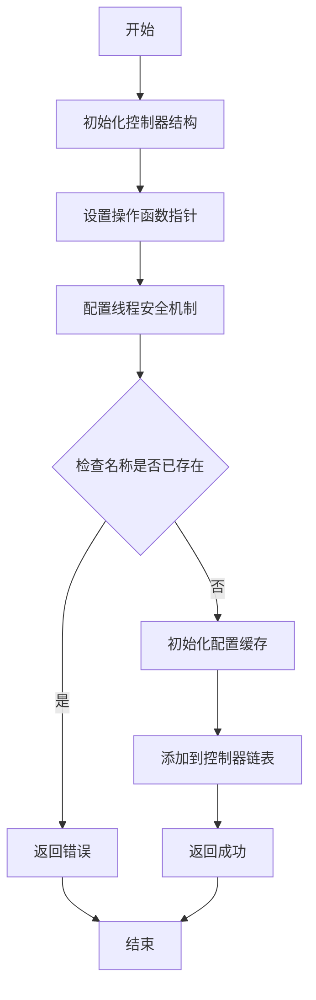
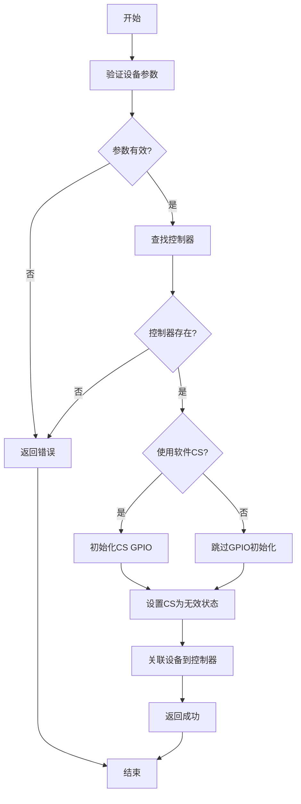
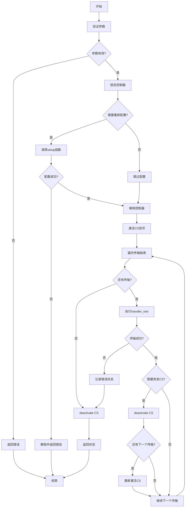
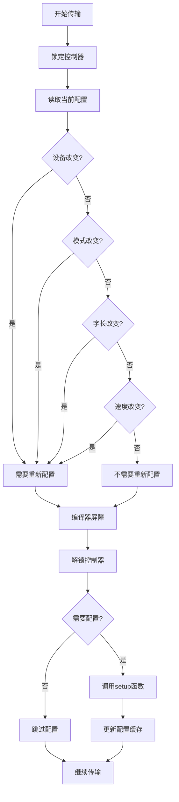

# SPI驱动框架设计文档

## 目录

1. [概述](#概述)
2. [设计目标](#设计目标)
3. [架构设计](#架构设计)
4. [核心数据结构](#核心数据结构)
5. [设计思路详解](#设计思路详解)
6. [使用指南](#使用指南)
7. [API参考](#api参考)
8. [流程图](#流程图)
9. [示例代码](#示例代码)
10. [线程安全机制](#线程安全机制)
11. [编译器优化兼容性](#编译器优化兼容性)
12. [常见问题](#常见问题)

---

## 概述

SPI驱动框架采用Linux内核风格的子系统设计，完全分离硬件抽象层和协议层，支持裸机和多种RTOS环境。框架设计遵循MISRA C:2012规范，无动态内存分配，最小化RAM和Flash占用。

### 主要特性

- **硬件抽象**：完全分离控制器驱动和协议层
- **资源优化**：静态分配，无动态内存
- **线程安全**：支持裸机、FreeRTOS、RT-Thread等环境
- **编译器优化兼容**：在不同优化级别下正常工作
- **Linux内核风格**：参考Linux内核SPI子系统设计

---

## 设计目标

### 1. 清晰的硬件抽象

- **控制器抽象**：`spi_controller`结构体封装硬件控制器
- **操作函数抽象**：`spi_controller_ops`结构体定义硬件操作接口
- **设备抽象**：`spi_device`结构体表示SPI设备

### 2. 资源受限优化

- 所有资源静态分配
- 禁止使用`malloc`/`free`
- 最小化RAM和Flash占用
- 配置缓存避免重复配置

### 3. 高效安全

- 符合MISRA C:2012规范
- 线程安全设计
- 内存屏障确保状态一致性
- 可重入函数设计

### 4. Linux内核风格

- 参考Linux内核SPI子系统
- 简化适配MCU环境
- 消息-传输两级抽象

---

## 架构设计

### 整体架构

```
┌─────────────────────────────────────────────────────────┐
│              应用层 (Application Layer)                 │
│  - spi_write() / spi_read() / spi_write_then_read()   │
│  - spi_w8r8() / spi_w8r16()                           │
└─────────────────────────────────────────────────────────┘
                        ↓
┌─────────────────────────────────────────────────────────┐
│            SPI协议层 (SPI Protocol Layer)               │
│  - spi_controller (控制器抽象)                          │
│  - spi_device (设备抽象)                                │
│  - spi_message / spi_transfer (消息传输)                │
│  - 线程安全机制 (kmutex/中断锁)                          │
│  - 配置缓存和状态管理                                   │
└─────────────────────────────────────────────────────────┘
                        ↓
┌─────────────────────────────────────────────────────────┐
│          BSP硬件层 (BSP Hardware Layer)                 │
│  - spi_controller_ops (硬件操作函数)                     │
│    - setup()      : 配置SPI控制器                        │
│    - set_cs()     : 控制片选信号                         │
│    - transfer_one(): 执行单次传输                       │
│  - HAL/LL库封装                                         │
│  - GPIO/DMA配置                                         │
└─────────────────────────────────────────────────────────┘
```

### 层次说明

1. **应用层**：提供简化的API接口，隐藏底层复杂性
2. **协议层**：实现SPI协议逻辑，管理控制器和设备
3. **硬件层**：由BSP实现，封装具体硬件操作

---

## 核心数据结构

### 1. spi_transfer (传输结构)

```c
struct spi_transfer {
    const void *tx_buf;                // 发送缓冲区指针
    void *rx_buf;                      // 接收缓冲区指针
    size_t len;                        // 传输长度（字节）
    unsigned cs_change : 1;            // 传输后改变CS状态
    struct list_node transfer_list;    // 消息链表节点
};
```

**说明**：
- 表示单次SPI传输操作
- 可以链接到消息中形成传输序列
- `cs_change`标志控制CS信号行为

### 2. spi_message (消息结构)

```c
struct spi_message {
    struct list_node transfers;        // 传输链表头
    struct spi_device *spi;           // 关联的SPI设备
    int status;                        // 传输状态
    void *context;                     // 上下文指针（可选）
};
```

**说明**：
- 包含多个传输的序列
- 原子执行所有传输
- 状态字段记录执行结果

### 3. spi_device (设备结构)

```c
struct spi_device {
    const char *name;                  // 设备名称
    struct spi_controller *controller; // 父控制器
    uint32_t max_speed_hz;             // 最大时钟频率
    uint8_t chip_select;               // CS编号（硬件CS）
    uint8_t mode;                      // SPI模式
    uint8_t bits_per_word;             // 每字位数
    size_t cs_pin;                     // CS引脚（软件CS）
    void *controller_data;             // 控制器私有数据
};
```

**说明**：
- 表示一个SPI设备
- 包含设备配置参数
- 支持硬件和软件CS

### 4. spi_controller_ops (控制器操作函数)

```c
struct spi_controller_ops {
    int (*setup)(struct spi_controller *ctrl, 
                 struct spi_device *dev);
    void (*set_cs)(struct spi_controller *ctrl, 
                   struct spi_device *dev, 
                   uint8_t enable);
    ssize_t (*transfer_one)(struct spi_controller *ctrl, 
                           struct spi_device *dev,
                           struct spi_transfer *transfer);
};
```

**说明**：
- 定义硬件操作接口
- 由BSP层实现
- 必须可重入（中断安全）

### 5. spi_controller (控制器结构)

```c
struct spi_controller {
    struct list_node node;             // 链表节点
    char name[SPI_NAME_MAX];           // 控制器名称
    const struct spi_controller_ops *ops;  // 操作函数
    void *priv;                        // 私有数据
    
    // 配置缓存（volatile保护）
    volatile uint8_t mode;
    volatile uint8_t bits_per_word;
    volatile uint32_t max_speed_hz;
    volatile uint32_t actual_speed_hz;
    struct spi_device *current_device;
    
    // 线程安全支持
    void (*lock)(void *lock_data);
    void (*unlock)(void *lock_data);
    void *lock_data;
    void (*irq_disable)(void);
    void (*irq_enable)(void);
};
```

**说明**：
- 控制器抽象
- 配置缓存避免重复配置
- 线程安全机制支持

---

## 设计思路详解

### 1. 硬件抽象设计

#### 问题
不同MCU的SPI控制器实现差异很大，直接操作硬件会导致代码不可移植。

#### 解决方案
采用三层抽象：
- **控制器抽象**：`spi_controller`封装控制器状态和配置
- **操作抽象**：`spi_controller_ops`定义硬件操作接口
- **设备抽象**：`spi_device`表示连接的设备

#### 优势
- 协议层代码完全独立于硬件
- BSP层只需实现三个函数
- 易于移植到不同MCU

### 2. 消息-传输两级抽象

#### 设计理念
参考Linux内核，采用消息（Message）和传输（Transfer）两级抽象：

```
Message (消息)
  ├── Transfer 1 (传输1)
  ├── Transfer 2 (传输2)
  └── Transfer 3 (传输3)
```

#### 优势
- **灵活性**：一个消息可以包含多个传输
- **原子性**：消息中的所有传输原子执行
- **CS控制**：可以在传输间控制CS信号

#### 示例场景
```c
// 场景：先写命令，再读数据，中间需要改变CS
struct spi_message msg;
struct spi_transfer t1, t2;

// 传输1：写命令（CS保持低）
t1.tx_buf = cmd;
t1.len = 1;
t1.cs_change = 0;  // CS不改变

// 传输2：读数据（传输后CS变高）
t2.rx_buf = data;
t2.len = 10;
t2.cs_change = 1;  // 传输后CS变高

spi_message_init(&msg);
spi_message_add_tail(&t1, &msg);
spi_message_add_tail(&t2, &msg);
spi_sync(dev, &msg);
```

### 3. 配置缓存机制

#### 问题
频繁切换设备时，重复配置控制器会降低性能。

#### 解决方案
在控制器中缓存当前配置：
- `mode`：当前SPI模式
- `bits_per_word`：当前字长
- `max_speed_hz`：当前速度
- `current_device`：当前设备

#### 工作流程
```
1. 检查配置是否改变
2. 如果改变，调用setup()重新配置
3. 如果未改变，跳过配置（性能优化）
```

#### 实现细节
```c
// 检查是否需要重新配置
need_setup = 0U;
if ((ctrl->current_device != dev) ||
    (ctrl->mode != dev->mode) ||
    (ctrl->bits_per_word != dev->bits_per_word) ||
    (ctrl->max_speed_hz != dev->max_speed_hz)) {
    need_setup = 1U;
}

if (need_setup != 0U) {
    ret = spi_controller_setup_internal(ctrl, dev);
}
```

### 4. 线程安全设计

#### 设计目标
- 支持裸机环境（中断锁）
- 支持RTOS环境（互斥锁）
- 统一接口，自动适配

#### 实现方式
使用函数指针抽象锁机制：
```c
struct spi_controller {
    void (*lock)(void *lock_data);      // RTOS: mutex_lock
    void (*unlock)(void *lock_data);    // RTOS: mutex_unlock
    void *lock_data;                    // RTOS: mutex handle
    
    void (*irq_disable)(void);         // 裸机: __disable_irq
    void (*irq_enable)(void);           // 裸机: __enable_irq
};
```

#### 锁机制选择
```c
static inline void spi_controller_lock(struct spi_controller *ctrl)
{
    if (ctrl->lock != NULL) {
        // RTOS环境：使用互斥锁
        ctrl->lock(ctrl->lock_data);
    } else if (ctrl->irq_disable != NULL) {
        // 裸机环境：禁用中断
        ctrl->irq_disable();
    }
}
```

### 5. 内存屏障和编译器优化兼容

#### 问题
编译器优化可能导致：
- 指令重排
- 状态读取不一致
- 内存操作顺序错误

#### 解决方案
1. **volatile关键字**：保护共享状态变量
2. **内存屏障**：确保内存操作顺序
3. **编译器屏障**：防止指令重排
4. **noinline属性**：防止关键函数被内联

#### 实现示例
```c
// volatile保护共享变量
volatile uint8_t mode;
volatile uint32_t max_speed_hz;

// 内存屏障确保写入完成
ctrl->mode = dev->mode;
__DSB();  // Data Synchronization Barrier

// 编译器屏障防止重排
asm volatile("" ::: "memory");

// 防止内联优化
static int __attribute__((noinline))
spi_controller_setup_internal(...) {
    // ...
}
```

---

## 使用指南

### 快速开始

#### 步骤1：实现BSP层硬件操作

```c
// 1. 定义硬件私有数据结构
struct stm32_spi_priv {
    SPI_HandleTypeDef *hspi;
    // 其他硬件相关数据
};

// 2. 实现setup函数
static int stm32_spi_setup(struct spi_controller *ctrl, 
                           struct spi_device *dev)
{
    struct stm32_spi_priv *priv = ctrl->priv;
    SPI_HandleTypeDef *hspi = priv->hspi;
    
    // 配置SPI参数
    hspi->Init.Mode = SPI_MODE_MASTER;
    hspi->Init.Direction = SPI_DIRECTION_2LINES;
    hspi->Init.DataSize = (dev->bits_per_word == 8) ? 
                          SPI_DATASIZE_8BIT : SPI_DATASIZE_16BIT;
    hspi->Init.CLKPolarity = (dev->mode & SPI_CPOL) ? 
                             SPI_POLARITY_HIGH : SPI_POLARITY_LOW;
    hspi->Init.CLKPhase = (dev->mode & SPI_CPHA) ? 
                          SPI_PHASE_2EDGE : SPI_PHASE_1EDGE;
    hspi->Init.NSS = SPI_NSS_SOFT;
    hspi->Init.BaudRatePrescaler = calculate_prescaler(dev->max_speed_hz);
    
    if (HAL_SPI_Init(hspi) != HAL_OK) {
        return -EIO;
    }
    
    // 更新实际速度
    ctrl->actual_speed_hz = calculate_actual_speed(hspi);
    
    return 0;
}

// 3. 实现set_cs函数
static void stm32_spi_set_cs(struct spi_controller *ctrl, 
                             struct spi_device *dev, 
                             uint8_t enable)
{
    if (dev->cs_pin != 0U) {
        // 软件CS：控制GPIO
        gpio_set_level(dev->cs_pin, enable ? 0 : 1);
    } else {
        // 硬件CS：由硬件自动控制
        // 通常不需要操作
    }
}

// 4. 实现transfer_one函数
static ssize_t stm32_spi_transfer_one(struct spi_controller *ctrl, 
                                      struct spi_device *dev,
                                      struct spi_transfer *transfer)
{
    struct stm32_spi_priv *priv = ctrl->priv;
    SPI_HandleTypeDef *hspi = priv->hspi;
    HAL_StatusTypeDef status;
    
    if ((transfer->tx_buf != NULL) && (transfer->rx_buf != NULL)) {
        // 全双工传输
        status = HAL_SPI_TransmitReceive(hspi, 
                                         (uint8_t *)transfer->tx_buf,
                                         (uint8_t *)transfer->rx_buf,
                                         transfer->len,
                                         HAL_MAX_DELAY);
    } else if (transfer->tx_buf != NULL) {
        // 只发送
        status = HAL_SPI_Transmit(hspi, 
                                 (uint8_t *)transfer->tx_buf,
                                 transfer->len,
                                 HAL_MAX_DELAY);
    } else {
        // 只接收
        status = HAL_SPI_Receive(hspi, 
                               (uint8_t *)transfer->rx_buf,
                               transfer->len,
                               HAL_MAX_DELAY);
    }
    
    if (status != HAL_OK) {
        return -EIO;
    }
    
    return (ssize_t)transfer->len;
}

// 5. 定义操作函数结构
static const struct spi_controller_ops stm32_spi_ops = {
    .setup = stm32_spi_setup,
    .set_cs = stm32_spi_set_cs,
    .transfer_one = stm32_spi_transfer_one,
};
```

#### 步骤2：注册控制器

```c
void bsp_spi_init(void)
{
    struct spi_controller ctrl;
    struct stm32_spi_priv priv;
    
    // 初始化硬件
    priv.hspi = &hspi1;
    HAL_SPI_Init(&hspi1);
    
    // 配置线程安全（RTOS环境）
    #ifdef USING_FREERTOS
    static SemaphoreHandle_t spi_mutex = NULL;
    spi_mutex = xSemaphoreCreateMutex();
    ctrl.lock = (void (*)(void *))xSemaphoreTake;
    ctrl.unlock = (void (*)(void *))xSemaphoreGive;
    ctrl.lock_data = spi_mutex;
    #else
    // 裸机环境：使用中断锁
    ctrl.irq_disable = __disable_irq;
    ctrl.irq_enable = __enable_irq;
    #endif
    
    // 注册控制器
    ctrl.priv = &priv;
    spi_controller_register(&ctrl, "spi1", &stm32_spi_ops);
}
```

#### 步骤3：创建并附加设备

```c
void my_device_init(void)
{
    struct spi_device my_dev;
    
    // 配置设备参数
    my_dev.name = "my_device";
    my_dev.max_speed_hz = 10000000U;  // 10MHz
    my_dev.mode = SPI_MODE_0;
    my_dev.bits_per_word = 8U;
    my_dev.chip_select = 0U;          // 硬件CS
    my_dev.cs_pin = 0U;                // 0表示使用硬件CS
    
    // 附加到控制器
    spi_device_attach(&my_dev, "spi1");
}
```

#### 步骤4：使用设备进行传输

```c
void my_device_transfer(void)
{
    uint8_t tx_data[10] = {0x01, 0x02, 0x03, ...};
    uint8_t rx_data[10];
    
    // 方法1：使用简化接口
    spi_write(&my_dev, tx_data, 10);
    spi_read(&my_dev, rx_data, 10);
    
    // 方法2：使用消息接口（更灵活）
    struct spi_message msg;
    struct spi_transfer transfer;
    
    spi_message_init(&msg);
    
    transfer.tx_buf = tx_data;
    transfer.rx_buf = rx_data;
    transfer.len = 10;
    transfer.cs_change = 0;
    list_node_init(&transfer.transfer_list);
    
    spi_message_add_tail(&transfer, &msg);
    spi_sync(&my_dev, &msg);
}
```

---

## API参考

### 控制器管理API

#### spi_controller_register()

注册SPI控制器。

```c
int spi_controller_register(struct spi_controller *ctrl, 
                            const char *name, 
                            const struct spi_controller_ops *ops);
```

**参数**：
- `ctrl`：控制器结构体指针
- `name`：控制器名称（唯一标识）
- `ops`：操作函数指针

**返回值**：
- `0`：成功
- `-EINVAL`：参数错误

**示例**：
```c
struct spi_controller ctrl;
spi_controller_register(&ctrl, "spi1", &stm32_spi_ops);
```

#### spi_controller_find()

查找控制器。

```c
struct spi_controller *spi_controller_find(const char *name);
```

**参数**：
- `name`：控制器名称

**返回值**：
- 控制器指针：成功
- `NULL`：未找到

### 设备管理API

#### spi_device_attach()

将设备附加到控制器。

```c
int spi_device_attach(struct spi_device *dev, const char *controller_name);
```

**参数**：
- `dev`：设备结构体指针
- `controller_name`：控制器名称

**返回值**：
- `0`：成功
- `-EINVAL`：参数错误

### 传输API

#### spi_write()

写入数据（简化接口）。

```c
int spi_write(struct spi_device *spi, const void *buf, size_t len);
```

**参数**：
- `spi`：设备指针
- `buf`：数据缓冲区
- `len`：数据长度

**返回值**：
- 写入的字节数：成功
- 负数：错误码

#### spi_read()

读取数据（简化接口）。

```c
int spi_read(struct spi_device *spi, void *buf, size_t len);
```

#### spi_write_then_read()

先写后读。

```c
int spi_write_then_read(struct spi_device *spi, 
                       const void *txbuf, size_t txlen, 
                       void *rxbuf, size_t rxlen);
```

#### spi_w8r8()

写一个字节，读一个字节。

```c
int spi_w8r8(struct spi_device *spi, uint8_t cmd);
```

**返回值**：
- 读取的字节值：成功
- 负数：错误码

#### spi_w8r16()

写一个字节，读两个字节。

```c
int spi_w8r16(struct spi_device *spi, uint8_t cmd, uint16_t *result);
```

#### spi_sync()

同步传输消息（底层接口）。

```c
int spi_sync(struct spi_device *dev, struct spi_message *message);
```

**说明**：
- 这是底层接口，提供最大灵活性
- 可以包含多个传输
- 可以精确控制CS信号

---

## 流程图

### 控制器注册流程



### 设备附加流程



### 消息传输流程



### 配置检查流程



---

## 示例代码

### 示例1：基本读写操作

```c
#include "spi.h"

void example_basic_rw(void)
{
    struct spi_device flash_dev;
    uint8_t tx_data[256];
    uint8_t rx_data[256];
    int ret;
    
    // 初始化设备
    flash_dev.name = "flash";
    flash_dev.max_speed_hz = 20000000U;  // 20MHz
    flash_dev.mode = SPI_MODE_0;
    flash_dev.bits_per_word = 8U;
    flash_dev.cs_pin = GPIO_PIN_4;  // 软件CS，使用GPIO4
    
    spi_device_attach(&flash_dev, "spi1");
    
    // 写入数据
    (void)memset(tx_data, 0xAA, sizeof(tx_data));
    ret = spi_write(&flash_dev, tx_data, sizeof(tx_data));
    if (ret < 0) {
        // 处理错误
        return;
    }
    
    // 读取数据
    ret = spi_read(&flash_dev, rx_data, sizeof(rx_data));
    if (ret < 0) {
        // 处理错误
        return;
    }
}
```

### 示例2：写命令后读数据

```c
void example_write_then_read(void)
{
    struct spi_device sensor_dev;
    uint8_t cmd = 0x03;  // 读命令
    uint8_t data[10];
    int ret;
    
    // 初始化设备
    sensor_dev.name = "sensor";
    sensor_dev.max_speed_hz = 1000000U;  // 1MHz
    sensor_dev.mode = SPI_MODE_0;
    sensor_dev.bits_per_word = 8U;
    sensor_dev.cs_pin = 0U;  // 硬件CS
    
    spi_device_attach(&sensor_dev, "spi1");
    
    // 写命令，读数据
    ret = spi_write_then_read(&sensor_dev, &cmd, 1, data, 10);
    if (ret < 0) {
        // 处理错误
        return;
    }
}
```

### 示例3：使用消息接口（复杂场景）

```c
void example_complex_transfer(void)
{
    struct spi_device eeprom_dev;
    struct spi_message msg;
    struct spi_transfer t1, t2, t3;
    uint8_t cmd[2] = {0x03, 0x00};  // 读命令+地址
    uint8_t dummy = 0xFF;
    uint8_t data[256];
    int ret;
    
    // 初始化设备
    eeprom_dev.name = "eeprom";
    eeprom_dev.max_speed_hz = 5000000U;  // 5MHz
    eeprom_dev.mode = SPI_MODE_0;
    eeprom_dev.bits_per_word = 8U;
    eeprom_dev.cs_pin = GPIO_PIN_5;
    
    spi_device_attach(&eeprom_dev, "spi1");
    
    // 初始化消息
    spi_message_init(&msg);
    
    // 传输1：发送命令和地址（CS保持低）
    t1.tx_buf = cmd;
    t1.rx_buf = NULL;
    t1.len = 2;
    t1.cs_change = 0;  // CS不改变
    list_node_init(&t1.transfer_list);
    spi_message_add_tail(&t1, &msg);
    
    // 传输2：发送dummy字节（CS保持低）
    t2.tx_buf = &dummy;
    t2.rx_buf = NULL;
    t2.len = 1;
    t2.cs_change = 0;  // CS不改变
    list_node_init(&t2.transfer_list);
    spi_message_add_tail(&t2, &msg);
    
    // 传输3：读取数据（传输后CS变高）
    t3.tx_buf = NULL;
    t3.rx_buf = data;
    t3.len = 256;
    t3.cs_change = 1;  // 传输后CS变高
    list_node_init(&t3.transfer_list);
    spi_message_add_tail(&t3, &msg);
    
    // 执行传输
    ret = spi_sync(&eeprom_dev, &msg);
    if (ret < 0) {
        // 处理错误
        return;
    }
}
```

### 示例4：多设备切换

```c
void example_multi_device(void)
{
    struct spi_device dev1, dev2;
    uint8_t data1[10], data2[10];
    
    // 设备1配置
    dev1.name = "device1";
    dev1.max_speed_hz = 10000000U;
    dev1.mode = SPI_MODE_0;
    dev1.bits_per_word = 8U;
    dev1.cs_pin = GPIO_PIN_4;
    spi_device_attach(&dev1, "spi1");
    
    // 设备2配置
    dev2.name = "device2";
    dev2.max_speed_hz = 5000000U;  // 不同速度
    dev2.mode = SPI_MODE_1;         // 不同模式
    dev2.bits_per_word = 8U;
    dev2.cs_pin = GPIO_PIN_5;
    spi_device_attach(&dev2, "spi1");
    
    // 使用设备1
    spi_write(&dev1, data1, 10);
    
    // 切换到设备2（自动重新配置）
    spi_write(&dev2, data2, 10);
    
    // 再次使用设备1（如果配置未变，不会重新配置）
    spi_read(&dev1, data1, 10);
}
```

---

## 线程安全机制

### 设计原理

框架通过函数指针抽象锁机制，自动适配不同环境：

```c
// RTOS环境
ctrl->lock = (void (*)(void *))xSemaphoreTake;
ctrl->unlock = (void (*)(void *))xSemaphoreGive;
ctrl->lock_data = mutex_handle;

// 裸机环境
ctrl->irq_disable = __disable_irq;
ctrl->irq_enable = __enable_irq;
```

### 使用场景

1. **配置检查**：防止配置被其他线程修改
2. **配置更新**：原子更新配置缓存
3. **状态查询**：安全读取控制器状态

### 注意事项

- 锁的粒度要小，避免长时间持有
- 不要在锁内调用可能阻塞的函数
- 中断上下文必须使用中断锁

---

## 编译器优化兼容性

### 问题场景

编译器优化可能导致：
1. 指令重排
2. 状态读取不一致
3. 内存操作顺序错误

### 解决方案

#### 1. volatile关键字

```c
volatile uint8_t mode;           // 防止优化
volatile uint32_t max_speed_hz;  // 强制每次读取
```

#### 2. 内存屏障

```c
ctrl->mode = dev->mode;
__DSB();  // 确保写入完成
```

#### 3. 编译器屏障

```c
asm volatile("" ::: "memory");  // 防止指令重排
```

#### 4. noinline属性

```c
static int __attribute__((noinline))
spi_controller_setup_internal(...) {
    // 防止被内联优化
}
```

### 测试验证

在不同优化级别（-O0, -O1, -O2, -O3, -Os）下测试，确保行为一致。

---

## 常见问题

### Q1: 如何选择硬件CS还是软件CS？

**A**: 
- **硬件CS**：设置`cs_pin = 0`，由SPI控制器硬件自动控制
- **软件CS**：设置`cs_pin`为GPIO引脚号，由软件控制

**选择建议**：
- 如果硬件支持且引脚足够，优先使用硬件CS（性能更好）
- 如果需要灵活控制CS时序，使用软件CS

### Q2: 如何实现DMA传输？

**A**: 在`transfer_one`函数中使用DMA：

```c
static ssize_t stm32_spi_transfer_one_dma(...)
{
    // 配置DMA
    HAL_SPI_TransmitReceive_DMA(hspi, tx_buf, rx_buf, len);
    
    // 等待DMA完成
    while (HAL_SPI_GetState(hspi) != HAL_SPI_STATE_READY);
    
    return len;
}
```

### Q3: 多设备共享控制器时如何避免冲突？

**A**: 
- 框架自动管理控制器锁定
- 每个设备使用独立的CS信号
- 配置缓存确保切换设备时正确配置

### Q4: 如何调试SPI通信问题？

**A**: 
1. 检查设备是否正确附加到控制器
2. 验证SPI模式、速度、字长配置
3. 使用示波器检查CS、CLK、MOSI、MISO信号
4. 检查线程安全是否正确配置

### Q5: 性能优化建议？

**A**: 
1. 使用硬件CS（如果支持）
2. 使用DMA传输（大数据量）
3. 避免频繁切换设备（配置缓存会帮助）
4. 使用合适的SPI速度

---

## 总结

SPI驱动框架采用Linux内核风格设计，提供了清晰的硬件抽象和灵活的接口。通过消息-传输两级抽象、配置缓存、线程安全等机制，实现了高效、安全、易用的SPI驱动框架。

### 核心优势

1. **硬件抽象**：完全分离协议层和硬件层
2. **资源优化**：静态分配，无动态内存
3. **线程安全**：支持多种环境
4. **编译器兼容**：在不同优化级别下正常工作
5. **易于使用**：提供简化接口和底层接口

### 适用场景

- 嵌入式MCU应用
- 资源受限环境
- 多设备SPI通信
- 需要高可靠性的应用

---

**文档版本**: V1.0  
**最后更新**: 2025-01-XX  
**作者**: ZJY

